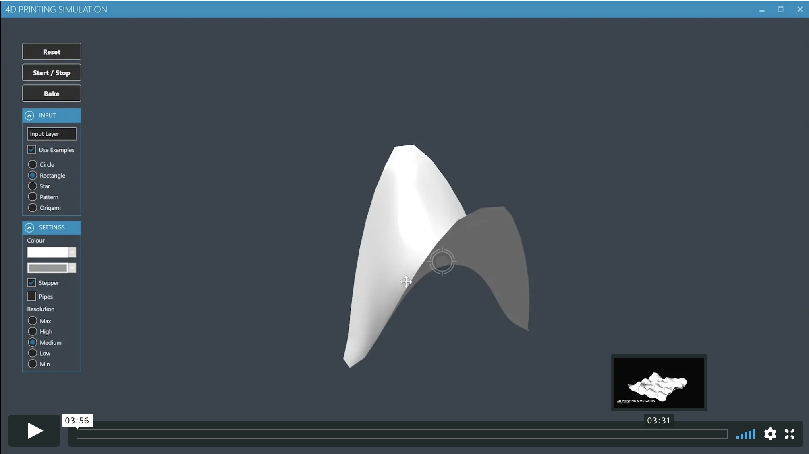
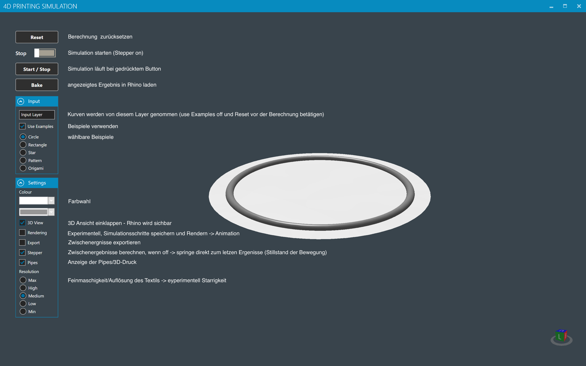
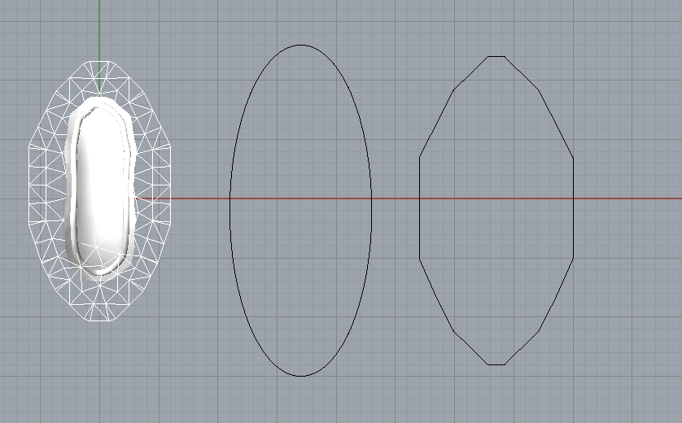

# 4D-Printing - Programmable-Textiles
from Ronny Haberer, Patrick Bösch for Rhino Win 5 & 6 (Bauhaus-Universität Weimar WS16/17)

note: 10.07.2020 \
I've added a stripped-down version of the simulation, a legacy gh-file and a library-folder (including Millipede) for Rhino 5.

4D-Printing describes the self assembly of 3D-printed objects over a period of time. 
With a structure printed on a stretched fabric, it is possible to “program” a textile. 
The goal of the project was to discover rules and evaluating the possibilities of this technology. 
The script uses "Rhinoceros 3D" and "Grasshopper" to make predictions about the behaviour of the textile.  \
https://www.rhino3d.com

Grasshopper libraries and plugins you will need:

Kangaroo: https://www.food4rhino.com/app/kangaroo-physics \
Weaverbird: http://www.giuliopiacentino.com/weaverbird/ \
HumanUi: https://www.food4rhino.com/app/human-ui (not stripped-down version)\
Anemone: https://www.food4rhino.com/app/anemone (not stripped-down version)\
Lunchbox: https://www.food4rhino.com/app/lunchbox \
Meshedit: https://www.food4rhino.com/app/meshedit (not stripped-down version)\
Elefront: https://www.food4rhino.com/app/elefront (not stripped-down version)\
Clipper: https://www.food4rhino.com/app/clipper-grasshopper-and-rhino \
Millipede: https://github.com/nickteeple/millipede-backup (if down use the files from the Rhino5 folder in this repo)

The original-script uses HumanUi to generate a frontend with options and quick-access buttons to control the script.

# Defining 4D-Problems
Use 2D curves and lines to define the rigid structure (e.g. 3d-printed). 
Huge curvature may cause problems in the script. If you see a problem in the areas, try a simpler version of the curve.
You can add the curves directly in GH or automatically via the predefined layer in the frontend (default "Input Layer").
If you change the curve-input you have to reset the script with the reset-button. 
If you forget to do so, strange things will happen and the simulation can't work properly.

Enjoying the script?

